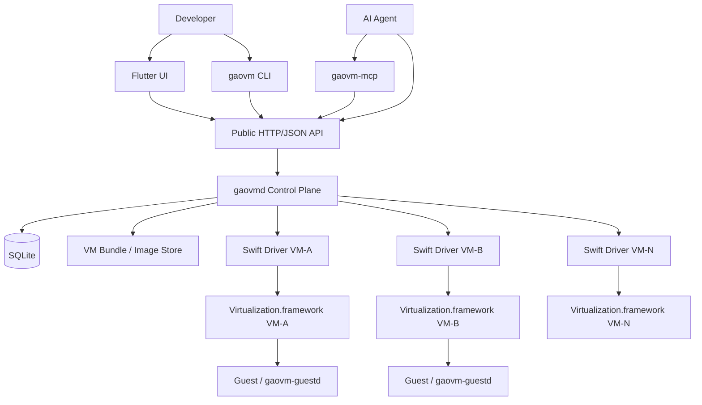

# GaoVM 架构设计

## 1. 文档目的

本文定义 GaoVM 的长期架构边界、核心领域模型、进程模型、API 契约、并发与恢复语义。

GaoVM 是一个运行于 macOS Apple Silicon 的通用本地虚拟机管理器。GaoOS 是首个重点 Guest Profile 和测试对象，但 GaoVM 核心不得硬编码为只能运行 GaoOS。

GaoVM 的第一阶段目标不是完整复刻 UTM 的全部设备和 Guest 类型，而是建立一个可靠的、多 VM 的、API-first 的管理平面，使人类客户端与 AI Agent 可以使用同一套稳定接口创建、启动、测试、观察和清理 VM。

本文同时描述 MVP core 与后续适配器。Flutter UI 和 MCP Adapter 属于 Beta，不是 Multi-VM Agent Testing MVP 的发布依赖。

---

## 2. 架构目标

### 2.1 核心目标

1. 在一个 daemon 中管理多个 VM 定义。
2. 允许多个 VM 并行运行，并确保单个 VM/driver 故障不影响其他 VM。
3. 提供版本化、机器可读、幂等的公共 API。
4. 将长时间操作建模为可查询、可取消的 `Operation`。
5. 将期望状态与观察状态分离，通过 reconciliation 保证最终收敛。
6. 支持 GaoOS 多版本并行测试、Guest readiness、命令执行和测试产物采集。
7. 保持控制面与平台运行时隔离，使未来增加 QEMU、Hyper-V、bhyve 等后端时不重写上层领域模型。
8. 所有客户端——CLI、Flutter UI、MCP Adapter、测试 Agent——只调用公共 API，不直接操作 runtime driver。

### 2.2 非目标

本架构首个里程碑不要求：

- 与 UTM 完整功能等价；
- x86 模拟；
- macOS 或 Windows Guest；
- 快照、暂停/恢复、USB passthrough、VirtioFS；
- bridged networking；
- 多用户 RBAC 或公网远程控制；
- 分布式 VM 调度；
- driver 热升级或无中断 daemon 接管现存 VZ 实例。

这些能力可以在不破坏本文核心模型的前提下后续扩展。

---

## 3. 设计原则

### 3.1 Resource-oriented

VM、Image、Operation、TestRun、Artifact 都是有稳定 ID、版本和生命周期的资源。不得用隐式 `"default"` VM 代替资源身份。

### 3.2 API-first 与 Agent-first

公共 API 是产品契约，CLI/UI/MCP 都是适配器。API 必须具备：

- OpenAPI 描述；
- 稳定错误码；
- 幂等键；
- revision/ETag；
- 异步 Operation；
- 可恢复事件 cursor；
- 条件等待；
- JSON 输出；
- labels 与 selector。

### 3.3 控制面与运行时分离

- Dart daemon `gaovmd` 是 VM catalog、期望状态、操作、事件和调度的 source of truth。
- Swift driver `gaovm-driver-vz` 只管理单个运行中的 VZ VM。
- driver 不持久化业务期望状态。
- daemon 不直接链接 `Virtualization.framework`。

### 3.4 单写者

每个 VM 只有一个逻辑 `VmController` 可以修改其 runtime state。一个 VM 内操作串行，不同 VM 之间可以并行。

### 3.5 纯状态转换与显式副作用

VM 控制器以 reducer 模型工作：

```text
reduce(current_state, command) -> transition
transition = {new_state, effects, emitted_events}
```

进程创建、RPC、文件操作、数据库提交等副作用由 effect runner 执行，结果以新 command 返回控制器。

### 3.6 Desired/Observed 分离

API 的 start/stop 不直接等价于“runtime 已完成动作”。它首先改变 desired state，再由 controller 收敛 observed state。

### 3.7 Driver 是临时执行单元

driver 可以被杀死和重建。所有可恢复业务状态位于 daemon 持久层，driver generation 用于拒绝过期回调。

### 3.8 本地安全默认值

- MVP 公共 API 使用 HTTP/1.1，默认且仅监听 Unix Domain Socket；
- socket 权限 `0600`，状态目录 `0700`；
- TCP 监听默认关闭；
- 每个 driver generation 使用独立随机 token；
- debug driver passthrough 不属于公共 API。

---

## 4. 系统上下文



---

## 5. 进程模型

### 5.1 固定进程

```text
GaoVM.app / launchd
└── gaovmd
```

`gaovmd` 是单用户控制面，负责：

- 公共 API；
- VM registry；
- operation manager；
- event journal；
- image/template catalog；
- host resource scheduler；
- test orchestration；
- per-VM logical controllers；
- driver process supervision。

### 5.2 动态进程

每个处于运行、启动或停止过程的 VM 拥有一个独立 driver：

```text
gaovmd
├── gaovm-driver-vz --vm-id <A> --generation <n>
├── gaovm-driver-vz --vm-id <B> --generation <n>
└── gaovm-driver-vz --vm-id <C> --generation <n>
```

一个 driver 只拥有一个 `VZVirtualMachine`。停止的 VM 不需要常驻 driver。

### 5.3 为什么不在单个 Swift 进程管理全部 VM

独立 driver 可以提供：

- 每 VM 独立故障域；
- 独立 VZ dispatch queue；
- 独立 AppKit display 生命周期；
- 独立 token、socket、PID 和日志；
- 更明确的 orphan cleanup；
- 更容易进行故障注入和测试；
- 后续按 VM 选择不同 backend driver。

### 5.4 Dart isolate 决策

Multi-VM MVP 不要求每个 `VmController` 使用独立 Dart isolate。driver 进程已经提供 runtime 隔离。

首版采用 daemon 内逻辑 actor：

- 每个 VM 一个串行 command queue；
- reducer 无 I/O；
- effect runner 异步执行；
- 不同 VM 的 effect 可并行。

只有在 profiling 证明单 isolate 成为瓶颈后，才把 controller 搬入 isolate。

---

## 6. 控制面组件

### 6.1 `ApiServer`

职责：

- HTTP/JSON v1 API；
- Unix Socket 默认监听；
- P1/Beta 可选 loopback TCP；
- request ID、idempotency key、deadline；
- input schema validation；
- OpenAPI；
- SSE event stream；
- error mapping。

HTTP handler 不得包含 VM 生命周期业务逻辑。

### 6.2 `VmRegistry`

职责：

- 从 repository 加载 VM catalog；
- 按 `vm_id` 创建/定位 `VmController`；
- 防止同一 VM 存在两个 controller；
- daemon 启动时触发全量 reconciliation；
- VM 删除完成后释放 controller。

### 6.3 `VmController`

每个 VM 一个逻辑 actor，职责：

- 维护 desired/observed 状态；
- 串行处理 VM command；
- 计算 effect；
- 管理 driver generation；
- 应用 restart policy；
- 更新 operation；
- 发出领域事件；
- 拒绝过期异步结果。

### 6.4 `DriverProcessManager`

职责：

- 根据 backend 选择 driver binary；
- 创建 generation-specific runtime directory；
- 生成 token；
- 启动 driver；
- 建立内部 RPC；
- heartbeat；
- graceful stop / SIGTERM / SIGKILL；
- 确认旧 generation 退出后再清理资源；
- 向 controller 回报结构化结果。

### 6.5 `OperationManager`

所有长操作都创建 `Operation`：

- VM create/delete（existing-VM clone 为 P1/Beta）；
- image import；
- start/stop/restart；
- guest exec；
- test run。

职责：

- operation 状态机；
- cancellation；
- deadline；
- progress；
- correlation；
- completion result；
- error persistence。

### 6.6 `EventJournal`

事件同时用于：

- UI 实时刷新；
- Agent 等待与恢复；
- 测试审计；
- 诊断。

事件必须持久化并具有单调递增 `sequence`。SSE 客户端可通过 `Last-Event-ID` 或 `after` cursor 恢复。

Event Journal 不是完整 event sourcing；SQLite 中的资源快照仍是主要读取模型。

### 6.7 `HostScheduler`

负责 admission control，而不是复杂云调度：

- host memory budget；
- 最大并发启动数；
- 最大运行 VM 数；
- driver process 数量；
-磁盘可用空间；
- host port/resource lease。

VM 是否能启动由 scheduler 返回结构化 decision。不同 VM 的 start operation 可以并行，但必须先获得 lease。

### 6.8 `ImageService`

职责：

- image manifest 校验；
- digest 计算；
- content-addressed 存储；
- GaoOS build 元数据；
- managed disk clone；
- image 引用计数；
- import 的临时文件与失败清理。

### 6.9 `TestRunService`

位于通用 VM primitives 上层：

```text
create VM from managed image
→ start
→ wait condition
→ guest exec
→ collect artifacts
→ stop
→ delete or retain
```

它不得直接调用 Swift driver，也不得在核心 VM spec 中硬编码 GaoOS 测试流程。

### 6.10 `GuestProfile`

Guest-specific 行为通过 profile 提供：

```text
generic-linux
gaoos
```

`gaoos` profile 可以定义：

- 默认 kernel command line；
- guest agent readiness；
- system metadata；
- 默认 artifact 路径；
- 测试结果解析；
- GaoOS build/version 识别。

---

## 7. 核心领域模型

所有公开 resource ID 使用 `<prefix>_<26-char Crockford Base32 ULID>`，并由服务端生成。固定前缀为 `vm_`、`img_`、`op_`、`evt_`、`tr_`、`art_` 和 `req_`。客户端必须把 ID 视为 opaque string；`event_sequence`、`spec_generation` 和 `driver_generation` 是独立的单调整数，不编码进 ID。

## 7.1 VirtualMachine

```json
{
  "api_version": "gaovm.io/v1alpha1",
  "kind": "VirtualMachine",
  "metadata": {
    "id": "vm_01J00000000000000000000000",
    "name": "gaoos-nightly-network",
    "labels": {
      "gaoos.channel": "nightly",
      "test.suite": "network"
    },
    "revision": 7,
    "created_at": "2026-09-04T08:00:00Z",
    "updated_at": "2026-09-04T08:10:00Z"
  },
  "spec": {
    "backend": "vz",
    "architecture": "arm64",
    "guest_profile": "gaoos",
    "cpu": 4,
    "memory_bytes": 4294967296,
    "boot": {
      "type": "linux_kernel",
      "kernel_image_id": "img_01J00000000000000000000001",
      "initrd_image_id": "img_01J00000000000000000000002",
      "command_line": "console=hvc0"
    },
    "disks": [
      {
        "id": "root",
        "source": {
          "type": "managed_image",
          "image_id": "img_01J00000000000000000000003"
        },
        "writable": true
      }
    ],
    "networks": [
      {
        "id": "net0",
        "mode": "shared",
        "mac_address": "02:..."
      }
    ],
    "graphics": {
      "enabled": true,
      "width": 1280,
      "height": 800
    },
    "serial": {
      "enabled": true,
      "capture": true
    },
    "guest_agent": {
      "enabled": true,
      "required_for_ready": true
    },
    "restart_policy": "on_failure"
  },
  "status": {
    "desired_state": "running",
    "phase": "running",
    "spec_generation": 3,
    "observed_generation": 3,
    "driver_generation": 8,
    "last_transition_at": "2026-09-04T08:10:00Z",
    "last_error": null
  }
}
```

### 7.2 Image

Image 是不可变资源：

```text
Image
├── id
├── digest
├── type
├── architecture
├── guest_profile
├── version
├── build_id
├── channel
├── manifest
└── object paths
```

建议类型：

```text
linux-kernel
initrd
raw-disk
gaoos-bundle
```

### 7.3 Operation

```text
pending → running → succeeded
                  ↘ failed
                  ↘ cancelled
```

必要字段：

```text
id
type
resource_type
resource_id
state
request_id
idempotency_key
progress
result
error
created_at
started_at
completed_at
deadline_at
```

### 7.4 Event

```text
sequence
event_id
type
resource_type
resource_id
operation_id
payload
occurred_at
```

### 7.5 TestRun

```text
TestRun
├── source image/template
├── VM overrides
├── readiness condition
├── ordered steps
├── timeout
├── cleanup policy
├── retain_on_failure
├── result
└── artifacts
```

### 7.6 Artifact

```text
Artifact
├── id
├── test_run_id / vm_id / operation_id
├── kind
├── path
├── content_type
├── size
├── digest
└── retention
```

---

## 8. VM 状态机

### 8.1 Desired state

首版只需：

```text
stopped
running
```

重启、kill、delete 是 command/operation，不作为长期 desired state。

### 8.2 Observed phase

```text
defined
provisioning
stopped
spawning_driver
handshaking
configuring
starting
running
stopping
crashed
failed
deleting
deleted
```

### 8.3 Restart policy

```text
never
on_failure
always
```

- API stop：将 desired 设置为 `stopped`，不会自动重启。
- Guest clean shutdown：
  - `never`/`on_failure`：desired 变为 `stopped`；
  - `always`：保持 `running` 并重新启动。
- Driver crash、VZ error：
  - `on_failure`/`always`：有界重试；
  - `never`：进入 `failed` 或 `stopped`。

### 8.4 Generation

必须区分：

- `spec_generation`：每次 spec 修改递增；
- `observed_generation`：runtime 已实际应用的 spec generation；
- `driver_generation`：每次 driver spawn 递增；
- `operation_id`：当前生命周期操作。

所有 driver 回调必须携带 `vm_id + driver_generation`。不匹配当前 generation 的回调必须忽略。

---

## 9. Controller reducer

Command 示例：

```text
StartRequested
StopRequested
RestartRequested
DeleteRequested
SpecUpdated
ReconcileRequested
DriverSpawned
DriverHandshakeCompleted
DriverCommandSucceeded
DriverCommandFailed
DriverExited
DriverChannelClosed
VmStateChanged
GuestAgentReady
HeartbeatMissed
RetryTimerFired
OperationCancelled
```

Effect 示例：

```text
PersistVm
PersistRuntime
AcquireHostLease
ReleaseHostLease
SpawnDriver
ConnectDriver
ConfigureRuntime
StartRuntime
StopRuntime
KillDriver
ScheduleRetry
CompleteOperation
FailOperation
EmitEvent
```

核心不变量：

1. reducer 不执行 I/O。
2. 一个 controller 同时只应用一个 command。
3. effect result 必须回到同一个 command queue。
4. effect 必须携带 generation/operation correlation。
5. public API handler 不直接调用 driver。
6. DB snapshot、operation、event 和 outbox row 必须在同一个 SQLite 事务中提交。

---

## 10. Persistence 与目录结构

### 10.1 SQLite

建议路径：

```text
~/Library/Application Support/GaoVM/gaovm.db
```

建议开启：

```text
WAL
foreign_keys = ON
busy_timeout
```

核心表：

```text
vms
vm_specs
vm_runtime
images
operations
events
test_runs
test_steps
artifacts
resource_leases
idempotency_keys
outbox
schema_migrations
```

### 10.2 文件系统

```text
~/Library/Application Support/GaoVM/
├── gaovm.db
├── images/
│   └── sha256-<digest>/
│       ├── manifest.json
│       └── objects/
├── vms/
│   └── <vm-id>.gaovm/
│       ├── manifest.json
│       ├── disks/
│       ├── nvram/
│       ├── logs/
│       │   ├── driver.log
│       │   └── serial.log
│       ├── artifacts/
│       └── runtime/
└── run/
    ├── api.sock
    └── <vm-id>/
        └── <driver-generation>/
            ├── driver.sock
            └── metadata.json
```

### 10.3 Source of truth

- SQLite：catalog、spec、desired/observed state、operations、events；
- VM bundle：VM 大文件、磁盘、日志、导出 manifest；
- image store：不可变内容；
- driver runtime directory：临时数据，可在 crash 后清理。

bundle manifest 用于导出和诊断，不得与数据库形成两个可独立修改的 source of truth。

---

## 11. 公共 API

### 11.1 Transport

默认：

```text
HTTP/1.1 over Unix Domain Socket
```

P1/Beta 可选（不阻塞 MVP）：

```text
127.0.0.1:<configured-port>
```

远程监听不属于 Multi-VM MVP。

### 11.2 API 分层

```text
/v1/vms
/v1/images
/v1/operations
/v1/events
/v1/test-runs
/v1/system
```

典型接口：

```text
GET    /v1/vms
POST   /v1/vms
GET    /v1/vms/{vm_id}
PATCH  /v1/vms/{vm_id}
DELETE /v1/vms/{vm_id}

POST   /v1/vms/{vm_id}/actions/start
POST   /v1/vms/{vm_id}/actions/stop
POST   /v1/vms/{vm_id}/actions/restart
POST   /v1/vms/{vm_id}/actions/kill
POST   /v1/vms/{vm_id}/wait

POST   /v1/vms/{vm_id}/guest/exec
GET    /v1/vms/{vm_id}/logs
GET    /v1/vms/{vm_id}/artifacts

GET    /v1/images
POST   /v1/images/import
DELETE /v1/images/{image_id}

GET    /v1/operations/{operation_id}
POST   /v1/operations/{operation_id}/cancel

GET    /v1/events
POST   /v1/test-runs
GET    /v1/test-runs/{test_run_id}
```

`POST /v1/vms/{vm_id}/actions/clone` 属于 P1/Beta；MVP 的 P0 provisioning 仅要求从 managed image 创建隔离 writable disk。

### 11.3 异步操作

写入请求返回：

```http
202 Accepted
```

```json
{
  "operation_id": "op_01J00000000000000000000000",
  "state": "pending",
  "resource_id": "vm_01J00000000000000000000000"
}
```

客户端通过 operation 查询或事件流等待完成。

### 11.4 幂等

所有创建资源和 action 请求支持：

```text
Idempotency-Key
```

同一 key、同一 request body：

- 返回相同 operation/resource；
- 不重复创建或执行。

同一 key、不同 body：

- 返回 `IDEMPOTENCY_CONFLICT`。

### 11.5 乐观并发

VM spec 更新使用：

```text
If-Match: "<revision>"
```

冲突返回：

```text
409 REVISION_CONFLICT
```

### 11.6 错误格式

采用 `application/problem+json` 风格：

```json
{
  "type": "https://gaovm.dev/problems/vm-not-found",
  "title": "VM not found",
  "status": 404,
  "code": "VM_NOT_FOUND",
  "detail": "No VM exists with id vm_01J00000000000000000000000",
  "request_id": "req_01J00000000000000000000000",
  "retryable": false,
  "operation_id": null
}
```

不得把 Dart `StateError` 或 Swift error 字符串直接作为稳定 API。

### 11.7 Agent 可发现性

- 提供 `/v1/openapi.json`；
- `gaovm schema` 输出资源 schema；
- `gaovm capabilities` 输出 backend/guest 能力；
- 所有列表支持 labels selector；
- 所有命令支持 `--json`；
- 所有 wait 有明确 timeout；
- 日志和 artifact 返回稳定引用，不把无限输出塞入单次响应。

---

## 12. 内部 driver 协议

### 12.1 Transport

继续使用：

```text
4-byte big-endian length + UTF-8 JSON-RPC object
Unix Domain Socket
```

协议版本：

```text
gaovm.driver.v2
```

### 12.2 Session

daemon 启动 driver 时传入：

```text
--vm-id
--generation
--socket-path
--bundle-path
--backend vz
```

token 仅通过环境变量传递。

每个 generation 使用唯一 socket：

```text
run/<vm-id>/<generation>/driver.sock
```

### 12.3 Method

```text
session.hello
session.ping
runtime.configure
runtime.start
runtime.stop
runtime.kill
runtime.status
display.open
display.close
display.status
console.status
guest.status
```

### 12.4 Event notification

driver 必须主动报告：

```text
runtime.state_changed
runtime.clean_shutdown
runtime.error
display.state_changed
console.ready
guest.channel_ready
driver.warning
```

### 12.5 Capability negotiation

协商必须是真实约束：

- daemon 只能调用 accepted capability；
- driver 对未协商 method 返回协议错误；
- protocol version 不兼容时立即失败；
- public API capability 与 driver capability 分离。

### 12.6 禁止 public `driver.exec`

内部 passthrough 仅可在 debug build 和显式环境开关下使用，不得暴露给 UI、MCP 或普通 API client。

---

## 13. Swift VZ runtime 执行模型

### 13.1 VZ queue

`VZVirtualMachine` 必须绑定显式串行 queue：

```text
vzRuntimeQueue
```

所有 VZ property/method 访问都在该 queue 上执行。

禁止：

- 在 VZ queue 上使用 semaphore 阻塞等待回调；
- 在任意 concurrent handler queue 直接访问 VM；
- 从 AppKit MainActor 直接修改 VZ runtime。

### 13.2 Async 生命周期

start/stop/kill 应转换为非阻塞异步 operation：

```text
RPC command
→ enqueue ordered runtime command
→ call VZ async API
→ completion/delegate event
→ send RPC result/event
```

control lane 的 `ping` 与 session 消息不应被长生命周期操作阻塞。

### 13.3 Delegate

driver 必须实现 `VZVirtualMachineDelegate`，把以下事件传给 daemon：

- guest clean shutdown；
- VM stopped with error；
- runtime state transition。

### 13.4 Display

- AppKit window 和 `VZVirtualMachineView` 由 MainActor 管理；
- display close 不停止 VM；
- display operation 与 runtime lifecycle 使用明确 coordination；
- 一个 driver 最多拥有一个 VM display window；
- headless VM 不初始化窗口。

### 13.5 Serial

每个 VM 可以配置 serial console：

- 输出持续写入 `serial.log`；
- early boot 和 kernel panic 可观察；
-日志写入有 rotation；
- interactive console 可作为后续扩展。

---

## 14. Guest Agent

### 14.1 定位

Guest Agent 是可选能力，不是运行通用 Linux VM 的必要条件；Guest protocol v1 core 与 GaoOS Guest Agent readiness/exec 是 GaoOS 自动化测试的 P0 组件。

建议 reference implementation：

```text
gaovm-guestd: Rust
```

协议保持语言无关。

### 14.2 Transport

优先使用 virtio-vsock。host 与 guest 之间建立版本化 guest protocol：

```text
gaovm.guest.v1
```

控制面消息可使用 framed JSON；文件和 artifact 使用独立 binary stream，避免 base64 大文件。

### 14.3 P0 最小能力

```text
hello/capabilities
health
system.info
exec.start
exec.status
exec.cancel
artifact.collect
```

`exec` 必须支持：

- argv 数组；
- cwd；
- environment；
- timeout；
- stdout/stderr 分离；
- exit code；
- output size limit；
- artifact fallback。

以下能力属于 P1/Beta，不阻塞 MVP：file upload/download、`service.status`/service logs、guest `shutdown`/`reboot`。

---

## 15. TestRun 架构

TestRun 是持久化 orchestration resource。MVP source 必须支持 image；template source 属于 P1/Beta：

```json
{
  "source": {
    "image_id": "img_01J00000000000000000000004"
  },
  "vm_overrides": {
    "cpu": 4,
    "memory_bytes": 4294967296
  },
  "wait": {
    "condition": "guest_agent_ready",
    "timeout_seconds": 120
  },
  "steps": [
    {
      "type": "guest.exec",
      "argv": ["gaoos-test", "network"],
      "timeout_seconds": 600
    }
  ],
  "cleanup": "delete_on_success",
  "retain_on_failure": true
}
```

状态：

```text
pending
provisioning
starting_vm
waiting_ready
running_steps
collecting
cleaning_up
succeeded
failed
cancelled
```

TestRun 必须产生：

- 结构化 step result；
- VM 和 operation 引用；
- serial/driver/guest logs；
- stdout/stderr artifact；
- cleanup decision；
- failure classification。

---

## 16. 一致性与事务

### 16.1 Command 接受

API 接受一个 command 时，应在一次事务中：

1. 验证 revision/idempotency；
2. 创建 operation；
3. 更新 desired/spec；
4. 插入可恢复 controller command；
5. 插入 durable event 与待发布 outbox row。

daemon crash 后，未完成 operation 可以重新进入 reconciliation。

### 16.2 Event 发布

采用 SQLite transactional outbox：resource/operation update、durable event 和 outbox row 在同一个事务中提交；dispatcher 只发布已提交的 outbox row，成功后幂等标记已发布。

```text
resource state committed
⇔ corresponding durable event exists
```

SSE 只发送已持久化 event。

### 16.3 删除

VM delete 是异步两阶段操作：

```text
mark deleting
→ stop runtime
→ release leases
→ remove managed files
→ mark deleted/tombstone
```

外部 disk 默认不删除。

---

## 17. 故障与恢复

### 17.1 daemon crash

- launchd 重启 daemon；
- 加载 VM、operation、lease；
- 清理无法匹配的 runtime directory；
- desired=`running` 的 VM 重新 reconcile；
- MVP 不尝试接管旧 driver；
-旧 driver 在 heartbeat/EOF 后停止 VM 并退出。

### 17.2 driver crash

- 只影响所属 VM；
- controller 根据 generation 记录退出；
- 释放/保留 lease 由策略决定；
- 根据 restart policy 有界重试；
- 其他 VM 不受影响。

### 17.3 Guest clean shutdown

通过 VZ delegate 分类为 clean shutdown，按 restart policy 处理，不应误算为 driver crash。

### 17.4 heartbeat failure

- 每个 session 只允许一个 in-flight heartbeat；
- 连续失败达到阈值后将 generation 标记 unhealthy；
- controller 终止该 driver 并进入 recovery；
- 只记录错误而不触发 recovery 是不允许的。

### 17.5 永久失败

超过 retry budget 后：

```text
phase = failed
desired_state = stopped
operation = failed
emit vm.permanent_failure
```

必须保留诊断信息，不得无限重启。只有新的显式 start 才能开始新的 retry cycle。

### 17.6 数据损坏

- SQLite 定期 checkpoint；
- image import 先写临时目录，再 atomic publish；
- managed disk create/clone 失败必须回滚 catalog；
-启动时验证 bundle 与 DB 引用；
-不可自动修复时进入 degraded 状态，不静默删除用户数据。

---

## 18. Security

### 18.1 本地模型

首版为单用户应用，不引入角色系统。

- state dir `0700`；
- API socket `0600`；
- driver socket 位于私有 runtime dir；
-随机 256-bit driver token；
- token 不出现在 CLI 参数和日志；
- API request/guest exec 记录审计事件；
-外部路径使用 allow-list/realpath 校验，防止 bundle 路径逃逸。

### 18.2 TCP

loopback TCP 是 P1/Beta 可选配置，不阻塞 MVP：

- 默认关闭；
- 启用时需要本地 API token；
-不得绑定非 loopback 地址。

远程 mTLS 是后续里程碑，不与 MVP 混合实现。

### 18.3 Guest trust

`guest.exec` 等价于对 Guest 的管理权限。公共 API 不应把 Guest 输出直接解释为可信 host command。

---

## 19. Observability

### 19.1 Structured logs

所有日志至少包含：

```text
timestamp
level
component
vm_id
operation_id
driver_generation
request_id
event_type
message
```

### 19.2 Metrics

首版内部记录：

- defined/running/failed VM 数；
- operation latency；
- driver restart count；
- heartbeat failure；
- API request latency；
- event subscriber lag；
- image store size；
- test pass/fail count。

### 19.3 Doctor

`/v1/system/doctor` 应检查：

- macOS/Apple Silicon；
- entitlement；
- driver binary；
- DB；
- state dir 权限；
- image store；
-可用 CPU/memory/disk；
- stale driver/socket；
- guest profile capability。

---

## 20. Repository 目标布局

```text
.
├── docs/
│   ├── ARCHITECTURE.md
│   ├── PRD.md
│   └── DEVELOPMENT_PLAN.md
├── schemas/
│   ├── openapi/
│   ├── vm-spec/
│   ├── driver-protocol/
│   └── guest-protocol/
├── libs/
│   ├── gaovm_models/
│   ├── gaovm_rpc/
│   └── gaovm_api_client/
├── daemon/
│   └── gaovmd/
│       └── lib/src/
│           ├── api/
│           ├── application/
│           ├── domain/
│           ├── controllers/
│           ├── drivers/
│           ├── persistence/
│           ├── images/
│           ├── operations/
│           ├── events/
│           ├── scheduler/
│           └── tests/
├── drivers/
│   └── vz_macos/
│       ├── Sources/
│       │   ├── DriverSession/
│       │   ├── Runtime/
│       │   ├── Display/
│       │   ├── Console/
│       │   └── Protocol/
│       └── Tests/
├── clients/
│   ├── gaovm_cli/
│   └── gaovm_ui/
├── adapters/
│   └── gaovm_mcp/
├── guest/
│   └── gaovm_guestd/
└── scripts/
    ├── ci/
    └── e2e/
```

---

## 21. 从当前单 VM 原型迁移

现有组件映射：

```text
DriverSupervisor
→ VmController + DriverProcessManager + RestartPolicy

VmConfigStore
→ VmRepository + versioned VmSpec

DaemonRpcServer
→ ApiServer + Application Services

RpcChannel
→ 保留为内部 driver protocol transport

main.swift
→ DriverSession + VzRuntime + DisplayController + Protocol

硬编码 default VM
→ 迁移为真实 `vm_` prefixed ULID VM
```

迁移规则：

1. 首次启动发现旧 `config.json` 时，创建一台名为 `migrated-default` 的 VM。
2. 旧 `desired_state.json` 映射为该 VM 的 desired state。
3. 迁移成功后写 marker，保证幂等。
4. 在一个过渡版本保留 legacy CLI adapter。
5. 新 API 和数据库稳定后删除单例代码路径。
6. 不允许同时维护“单例模式”和“多 VM 模式”两套 runtime 实现。

---

## 22. 非协商架构约束

1. 多 VM 是核心能力，不是未来扩展。
2. 所有 VM RPC/action 必须携带 `vm_id`。
3. 一个运行中的 VM 对应一个独立 driver 进程。
4. 一个 VM 的状态只能由其 `VmController` 修改。
5. 对外 API 不暴露 driver passthrough。
6. UI、CLI、MCP 不直接连接 driver。
7. API action 不阻塞等待完整 VM boot，必须返回 Operation。
8. Event 必须有持久 sequence 和恢复 cursor。
9. driver、spec 和 operation 的异步结果必须带 generation/correlation。
10. Swift VZ API 只能在关联 dispatch queue 上访问，禁止 semaphore 阻塞该 queue。
11. GaoOS-specific 行为位于 Guest Profile/TestRun 层，不污染通用 VM core。
12. SQLite 与 managed bundle 操作必须具备 crash-consistent 语义。
13. 所有 resource ID 使用冻结的 prefixed ULID 格式。
14. resource/operation/event/outbox 必须以 SQLite transactional outbox 原子提交。
