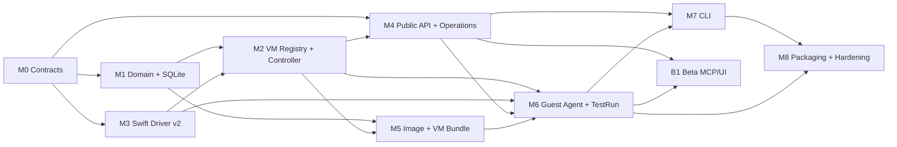

# GaoVM Multi-VM 与 Agent API 开发计划

## 1. 目标

本计划将当前单 VM 技术原型迁移为：

```text
一个 gaovmd
→ 管理多个 VM 资源
→ 每个运行 VM 一个独立 Swift driver
→ 统一 HTTP/JSON API
→ Operation + durable event
→ GaoOS Guest Agent + TestRun
```

计划优先保证领域模型、并发正确性、故障恢复和 API 契约。Flutter UI 在 public API 稳定后实施，不允许 UI 反向决定 daemon 领域模型。

---

## 2. 当前起点

现有代码已经具备可复用资产：

- Dart length-prefixed JSON-RPC codec；
- Unix Socket；
- daemon 与 Swift driver 分进程；
-基础 CLI；
- driver handshake/token；
- driver supervision/backoff 雏形；
- atomic JSON helper；
-日志 rotation；
- VZ Linux boot；
- NAT、disk、graphics；
- display open/close；
- fake driver 与部分 daemon tests；
- macOS happy-path script。

现有核心限制：

- 全局只有一台隐式 VM；
- `list_vms` 返回硬编码 `default`；
- `vm.*` API 无 `vm_id`；
-全局 config/state/driver socket；
- daemon supervisor 不是严格串行状态机；
- Swift VZ queue/async 模型需要修正；
-缺少 VZ delegate runtime event；
-无 durable operation/event journal；
-无 image catalog；
-无 guest readiness/exec；
-无 TestRun；
-无真正测试 CI 和发布管线。

---

## 3. 执行原则

1. **先契约，后实现**：schema/API/state machine 先合并。
2. **每个 PR 一个明确不变量**：避免单个超大 PR 同时更改 domain、protocol、driver 和 UI。
3. **先 fake driver，后真实 VZ**：多 VM controller 必须可在 Linux/macOS CI 中使用 fake driver 验证。
4. **单 VM 写入串行，跨 VM 并行**。
5. **新旧模式不长期并存**：只允许短期 legacy adapter，不维护两套 runtime core。
6. **任何长动作必须有 Operation**。
7. **任何状态变化必须有 durable Event**。
8. **任何异步结果必须带 vm_id、generation、operation_id**。
9. **所有 public client 只走 public API**。
10. **测试先覆盖故障路径，再增加 UI 功能**。

---

## 4. 目标模块

```text
gaovm_models
  ├── Resource IDs
  ├── VmSpec
  ├── VmStatus
  ├── Image
  ├── Operation
  ├── Event
  └── TestRun

gaovmd
  ├── API
  ├── Application Services
  ├── VmRegistry
  ├── VmController
  ├── DriverProcessManager
  ├── OperationManager
  ├── EventJournal
  ├── HostScheduler
  ├── ImageService
  ├── TestRunService
  └── Persistence

gaovm-driver-vz
  ├── DriverSession
  ├── Protocol
  ├── VzRuntime
  ├── VzConfiguration
  ├── DisplayController
  └── SerialController

gaovm_guestd
  ├── vsock
  ├── health
  ├── exec
  └── artifact

gaovm_cli / gaovm_ui / gaovm_mcp
  └── gaovm_api_client
```

---

## 5. 依赖图



允许并行：

- M1 Domain/Persistence 与 M3 Swift driver refactor 可并行；
- M4 API schema/server skeleton 可与 M2 controller 并行，但业务 handler 最后接入；
- M5 image store 与 M6 guest protocol prototype 可并行；
- UI 和 MCP 可在 public API contract 冻结后作为 Beta track 并行，但不位于 MVP → M8 发布依赖链上。

---

# 6. 里程碑

## M0：冻结架构与协议契约

### 目标

建立后续代码必须遵循的 canonical 文档和 schema。

### 任务

#### M0.1 合并核心文档

- `docs/ARCHITECTURE.md`
- `docs/PRD.md`
- `docs/DEVELOPMENT_PLAN.md`

三份文档在 M0 使用 `status: accepted` 与 `m0_contract: frozen`，`docs/` 是唯一 canonical 位置。P0 requirement-to-milestone/test mapping 位于 `docs/PRD.md` 的 8.0 节。

#### M0.2 增加 schema 目录

```text
schemas/
├── openapi/gaovm-v1.yaml
├── vm-spec/v1alpha1.schema.json
├── driver-protocol/v2.schema.json
└── guest-protocol/v1.schema.json
```

#### M0.3 定义 ID 与版本

```text
vm_id        = vm_<ULID>
image_id     = img_<ULID>
operation_id = op_<ULID>
event_id     = evt_<ULID>
test_run_id  = tr_<ULID>
artifact_id  = art_<ULID>
request_id   = req_<ULID>
spec_generation
driver_generation
event_sequence
```

`<ULID>` 是 26 字符 Crockford Base32 ULID。ID 由服务端生成并作为 opaque string 使用；generation 与 event sequence 是独立单调整数。

#### M0.4 定义错误码

至少包含：

```text
VM_NOT_FOUND
VM_ALREADY_RUNNING
VM_NOT_RUNNING
VM_OPERATION_CONFLICT
VM_SPEC_INVALID
REVISION_CONFLICT
HOST_RESOURCE_EXHAUSTED
DRIVER_START_FAILED
DRIVER_UNHEALTHY
GUEST_AGENT_UNAVAILABLE
GUEST_EXEC_FAILED
WAIT_TIMEOUT
OPERATION_NOT_CANCELLABLE
IDEMPOTENCY_CONFLICT
IMAGE_IN_USE
```

#### M0.5 更新 `AGENTS.md`

加入非协商约束：

- multi-VM；
- public API/driver protocol 分离；
- per-VM controller；
- one driver per running VM；
- operation/event；
- generation；
- no public driver passthrough；
- VZ queue 约束。

### 验收

- 文档和 schema 无单例 `default VM` 假设；
- 所有 VM action 明确 `vm_id`；
- OpenAPI、VmSpec 与 driver protocol 使用独立版本；
- public transport 冻结为 HTTP/1.1 over UDS；
- durable state/event publishing 冻结为 SQLite transactional outbox；
- CI 可以 lint/validate JSON Schema 和 OpenAPI。

---

## M1：Domain Model 与 SQLite 持久层

### 目标

建立与 runtime 无关的多 VM resource model。

### 任务

#### M1.1 新建 `libs/gaovm_models`

定义强类型模型：

```text
VirtualMachine
VmMetadata
VmSpec
VmStatus
Image
Operation
Event
TestRun
Artifact
Problem
```

禁止 domain 内使用任意 `Map<String, Object?>` 作为核心模型；Map 只允许存在于 serialization boundary。

#### M1.2 SQLite bootstrap

实现：

- migration runner；
- schema version；
- WAL；
- foreign keys；
- busy timeout；
-事务 helper；
- repository interfaces。

#### M1.3 建表

```text
vms
vm_specs
vm_runtime
images
operations
events
test_runs
test_steps
artifacts
resource_leases
idempotency_keys
outbox
schema_migrations
```

#### M1.4 VM repository

实现：

- create/list/get/patch/mark deleting；
- labels；
- revision；
- spec generation；
- tombstone；
-事务测试。

#### M1.5 Operation/Event repository

实现：

- create/transition/complete/fail；
- append durable event；
- sequence；
-查询 cursor；
- SQLite transactional outbox（resource/operation/event/outbox row 同事务，发布幂等）。

#### M1.6 旧数据迁移

首次启动发现旧文件时：

```text
config.json
desired_state.json
daemon_state.json
```

创建 `migrated-default` VM，写 migration marker。迁移必须幂等。

### 测试

- repository unit tests；
- transaction rollback；
- concurrent revision conflict；
- migration idempotency；
- event sequence monotonic；
- idempotency key conflict。

### 验收

- 可以在没有 driver 的情况下 CRUD 多台 VM；
- daemon 重启后资源、operation、event 完整；
-旧配置只迁移一次；
- SQLite 是唯一 active catalog source of truth。

---

## M2：VmRegistry、VmController 与多 VM fake runtime

### 目标

在不依赖真实 VZ 的前提下实现正确的多 VM control plane。

### 任务

#### M2.1 `VmRegistry`

- 按 vm_id 加载/创建 controller；
-保证单 controller；
- lazy activation；
-删除后的 shutdown；
- daemon startup reconcile。

#### M2.2 reducer

定义：

```text
VmControllerState
VmCommand
VmEffect
VmTransition
```

Reducer 必须是纯函数。

#### M2.3 serial command queue

每个 controller：

- command FIFO；
-同一 VM 不并发 effect completion；
-不同 VM 可并行；
-所有 timer/callback 转为 command；
-无 `_startInProgress` 类散布状态。

#### M2.4 generation

实现：

- driver generation；
- operation correlation；
-过期 callback 丢弃；
- generation-specific runtime directory。

#### M2.5 Driver abstraction

定义：

```text
RuntimeDriverFactory
RuntimeDriverSession
RuntimeCommand
RuntimeEvent
DriverCapabilities
```

现有 RPC transport 位于 adapter 层。

#### M2.6 Fake driver

支持：

- configurable start delay；
- state events；
- crash；
- heartbeat hang；
- configure failure；
- VM start failure；
- clean guest shutdown；
- out-of-order/late generation callback；
- large log/event。

#### M2.7 Restart policy

实现：

- never/on_failure/always；
- exponential backoff；
- sliding window；
- stable window reset；
- permanent failure：retry budget 耗尽时原子设置 desired=`stopped`、phase=`failed`、operation failed，并发出 `vm.permanent_failure`；仅显式 start 开启新 retry cycle。

#### M2.8 HostScheduler MVP

实现：

- running VM limit；
- concurrent boot limit；
- memory budget；
- lease acquire/release/recovery。

### 测试

重点必须覆盖：

1. 3 台 VM 并行启动；
2. VM-A crash 不影响 VM-B；
3.同一 VM start/stop 冲突；
4. stop 到达时 spawn 尚未完成；
5.旧 generation exit 在新 generation 启动后到达；
6. heartbeat hang；
7. daemon startup reconcile；
8. restart budget；
9. scheduler resource exhaustion；
10. controller shutdown 无 pending timer。

建议为 reducer 增加 property/invariant tests：

```text
at most one active driver generation
stopped desired never starts new runtime
deleted VM never emits start effect
terminal operation never transitions back
```

### 验收

- fake runtime 下完成完整多 VM acceptance；
- controller 不直接依赖 Socket/Process/File；
-所有状态变化通过 command/reducer；
-无全局 `DriverSupervisor` 单例。

---

## M3：Swift Driver Protocol v2 与 VZ 正确性

### 目标

把现有单文件 Swift driver 重构为可可靠承载每 VM runtime 的 driver v2。

### 任务

#### M3.1 文件拆分

```text
Sources/
├── App/main.swift
├── Protocol/
│   ├── FrameCodec.swift
│   ├── JsonRpc.swift
│   └── DriverProtocol.swift
├── DriverSession/
│   ├── DriverSession.swift
│   ├── Authentication.swift
│   └── Heartbeat.swift
├── Runtime/
│   ├── VzRuntime.swift
│   ├── VzConfigurationBuilder.swift
│   ├── VzState.swift
│   └── VzDelegate.swift
├── Display/
│   └── DisplayController.swift
├── Console/
│   └── SerialController.swift
└── Support/
    └── RotatingLogger.swift
```

#### M3.2 参数与 identity

driver 必须接收：

```text
--vm-id
--generation
--socket-path
--bundle-path
```

token 仍仅通过环境变量。

#### M3.3 修复 VZ queue

- 使用显式 `vzRuntimeQueue`；
-所有 VZ 调用在关联 queue；
-删除 queue 内 semaphore；
- async completion 不阻塞 control lane；
- unit tests/assertion 验证 queue 使用。

#### M3.4 有序 runtime command lane

- session/ping 可快速处理；
- configure/start/stop/kill 严格 FIFO；
- status 可读取一致 snapshot；
-避免 concurrent RPC 打乱生命周期命令。

#### M3.5 `VZVirtualMachineDelegate`

发送：

```text
runtime.state_changed
runtime.clean_shutdown
runtime.error
```

#### M3.6 Display

- MainActor 管理 AppKit；
- open/close 可重复；
- close 不停止 VM；
- lifecycle/display race 有明确结果。

#### M3.7 Serial

配置 Virtio console并输出到 per-VM `serial.log`。

#### M3.8 Stop policy

- graceful request stop；
- timeout；
- force stop；
-明确 event；
- daemon timeout 与 driver policy 对齐。

#### M3.9 Driver tests

- frame truncation/max size；
- handshake/auth；
- ordered commands；
- heartbeat timeout；
- delegate event mapping；
- display lifecycle；
- stop escalation；
- generation echo；
- fatal protocol violation；
- EOF cleanup。

### 验收

- `swift test` 覆盖核心 runtime adapter；
-不再有 VZ queue blocking；
-driver event 可以驱动 daemon observed state；
- driver 能作为多个独立进程并行运行。

---

## M4：Public API、Operation 与 Event Stream

### 目标

将现有 client JSON-RPC 替换为稳定 public API；保留 JSON-RPC 作为 driver 内部协议。

### 任务

#### M4.1 API server

- HTTP/1.1 over UDS（MVP 唯一 public transport）；
- `/v1` routing；
- JSON body limit；
- request ID；
- deadline；
- problem details；
- OpenAPI endpoint。

#### M4.2 VM API

```text
create/list/get/patch/delete
start/stop/restart/kill
wait
```

基于已有 VM 的 `clone` action 是 P1/Beta，不属于 M4 MVP 验收；从 managed image 创建 writable disk 仍是 M5 P0 provisioning。

handler 调用 application service，不直接访问 controller/driver。

#### M4.3 Operation API

```text
get/list/cancel/wait
```

#### M4.4 Event SSE

- `Last-Event-ID`；
- `after`；
- filters；
- subscriber backpressure；
- heartbeat comment；
-断线恢复测试。

#### M4.5 Idempotency

- request hash；
- resource/operation replay；
-冲突；
- retention cleanup。

#### M4.6 OCC

- ETag/revision；
- `If-Match`；
- 409 structured conflict。

#### M4.7 Legacy adapter

短期保留现有 CLI RPC 语义时，只允许作为 public application service 的 adapter。不得继续直接调用 driver。

### 测试

- OpenAPI contract tests；
- all endpoint integration tests；
- invalid schema；
- idempotency replay/conflict；
- concurrent patch conflict；
- operation cancellation；
- SSE resume；
- slow subscriber；
- API restart。

### 验收

- curl/Agent 可以仅用 public API 完成多 VM lifecycle；
- action 立即返回 operation；
- public API 无 driver method；
-所有错误可由稳定 code 判断。

---

## M5：Image Store、VM Bundle 与 Managed Disk Provisioning

### 目标

让 Agent 不再手工拼接任意文件路径，并支持 GaoOS 多版本。

### 任务

#### M5.1 Image manifest

支持：

```text
linux-kernel
initrd
raw-disk
gaoos-bundle
```

字段：

```text
digest
architecture
type
guest_profile
version
build_id
channel
objects
```

#### M5.2 Atomic import

```text
temporary staging
→ digest/validate
→ atomic publish
→ DB transaction
```

失败必须清理 staging。

#### M5.3 VM bundle

创建：

```text
vms/<vm-id>.gaovm/
```

管理：

- disks；
- logs；
- artifacts；
- manifest；
- runtime。

#### M5.4 Managed disk clone

- APFS clonefile；
- fallback copy；
- progress；
- cancellation；
- available-space check；
- crash cleanup。

#### M5.5 Image reference

-引用计数或引用查询；
- in-use delete rejection；
- orphan scan/doctor。

#### M5.6 GaoOS profile manifest

可识别：

```text
version
build_id
channel
kernel
initrd
root_disk
default_command_line
guest_agent_expected
```

### 测试

-重复 import digest dedup；
- corrupt manifest；
- cancellation；
- low disk；
- crash before publish；
- image in use；
- clone isolation；
- external disk 不被删除。

### 验收

-同时从不同 GaoOS image 创建多个隔离 VM；
-删除 VM 不影响 base image；
- image import/managed-disk provisioning 可通过 operation 查询。

---

## M6：Guest Agent、Readiness 与 TestRun

### 目标

完成 AI Agent 管理和测试 GaoOS 的闭环。

### 任务

#### M6.1 Guest protocol v1

冻结的 P0 core 定义：

```text
hello/capabilities
health
system.info
exec.start
exec.status
exec.cancel
artifact.collect
```

P1/Beta 扩展为 file upload/download、service status/logs、shutdown 和 reboot；这些 method 不阻塞 Guest protocol v1 core 或 MVP。

#### M6.2 `gaovm-guestd`

建议 Rust 实现：

-小型常驻服务；
-vsock；
-命令执行；
-timeout/cancel；
-output limit；
- structured result；
-最小权限；
- graceful shutdown。

#### M6.3 Host guest session

daemon：

- per-VM guest channel；
- reconnect；
- capability；
-readiness；
-guest operation correlation；
-断线时完成/失败语义。

#### M6.4 Wait conditions

支持：

```text
runtime_running
guest_agent_ready
guest_service_ready
operation_completed
test_run_completed
```

#### M6.5 Guest exec API

- argv；
-cwd/env；
-timeout；
-cancel；
-inline output threshold；
-artifact spill；
-stable exit code/error。

#### M6.6 TestRun service

- create/status/cancel；
-provision VM；
-start；
-wait；
-steps；
-artifacts；
-cleanup；
-retain_on_failure。

#### M6.7 Artifacts

至少收集：

```text
driver.log
serial.log
guest stdout
guest stderr
test result
system info
```

#### M6.8 GaoOS E2E

真实 GaoOS test image：

- Guest Agent ready；
-执行 smoke test；
-返回结果；
-成功删除；
-失败保留。

### 测试

- guest never ready；
- guest disconnect；
- exec timeout；
- cancel；
- output overflow；
- test step failure；
-cleanup failure；
- retain_on_failure；
-daemon restart during test；
- P1/Beta：multiple versions matrix。

### 验收

- Agent 可完全通过 API 发起并完成 GaoOS 测试；
-不需要打开 display；
-失败环境和 artifact 可追踪；
-无 Guest Agent VM 仍可基础管理。

---

## M7：CLI（MVP）

### 任务

重写为 `gaovm_api_client` client：

```text
gaovm vm create/list/get/patch/delete
gaovm vm start/stop/restart/kill/wait
gaovm image import/list/get/delete
gaovm operation get/wait/cancel
gaovm guest exec
gaovm test run/get/cancel/artifacts
gaovm events
gaovm doctor
```

要求：

-所有命令支持 `--json`；
-稳定 exit code；
-显式 timeout；
- P1/Beta：支持 spec file；
-不包含 daemon business logic。

### 验收

- CLI 仅通过 HTTP/1.1 public API 操作所有 P0 resource；
- 所有 P0 命令具备稳定 JSON、exit code 和显式 timeout；
- CLI 创建的 VM/operation 可由任何 public API client 查询和接管。

---

## B1：MCP 与 Flutter UI（Beta，不阻塞 MVP）

B1 不属于 M8 的前置依赖，可以与 MVP hardening 并行或在 MVP 发布后交付。

### B1.1 MCP Adapter

独立进程：

```text
gaovm-mcp
```

tools：

```text
vm_list
vm_get
vm_create
vm_clone
vm_start
vm_stop
vm_wait
vm_logs
image_list
image_import
guest_exec
operation_get
operation_cancel
test_run
test_status
test_artifacts
```

MCP 不得连接 driver socket。

### B1.2 Flutter UI

API 稳定后实现：

- VM list/detail；
- image catalog；
- lifecycle；
-display；
-events/logs；
-operations；
-TestRun/artifacts；
-host status。

### Beta 验收

- CLI、MCP、UI 对相同资源返回一致状态；
-任何一个客户端创建的 VM 都能被其他客户端接管；
- UI 关闭不停止 daemon/VM。

---

## M8：Packaging、CI、E2E 与发布加固

### 目标

形成可安装、可升级、可验证的 macOS 产品。

### 任务

#### M8.1 CI

普通 CI：

- Dart format/analyze/test；
- Swift format/lint/build/test；
- schema/OpenAPI validate；
- migration tests；
- fake driver integration。

Apple Silicon self-hosted CI：

- codesign；
-entitlement 检查；
-真实 VZ boot；
-多 VM E2E；
-driver crash；
-daemon restart；
-display；
-serial；
-GaoOS Guest Agent；
-TestRun。

#### M8.2 Packaging

- `GaoVM.app`；
- embedded driver；
- `gaovm` CLI；
- launchd plist；
-code signing；
-notarization（发布需要时）；
-install/update/uninstall。

#### M8.3 Upgrade

- DB migration；
-driver/public protocol compatibility check；
-失败回滚；
-旧 VM bundle 保留；
-version doctor。

#### M8.4 Chaos tests

- kill daemon；
-kill driver；
-close socket；
-corrupt partial staging；
-low disk；
-slow guest；
-stale generation；
-event subscriber lag；
-concurrent Agent requests。

#### M8.5 Documentation

- quick start；
-API guide；
-GaoOS image build/import；
-Agent automation；
-troubleshooting；
-data backup/export。

### 验收

满足 PRD 发布门槛，生成首个 Multi-VM Agent Testing MVP release。

---

# 7. 建议 PR 拆分

下面的 PR 顺序允许多 Agent 并行，但每个 PR 仍需独立可审查。

| PR | 内容 | 依赖 | 可并行 |
|---|---|---|---|
| 001 | Canonical docs + AGENTS invariants | 无 | 否 |
| 002 | VmSpec/Resource typed models | 001 | 与 004 |
| 003 | OpenAPI/JSON schema validation CI | 001 | 与 002 |
| 004 | Swift driver source split，无行为变化 | 001 | 与 002 |
| 005 | SQLite migrations/repositories | 002 | 与 006 |
| 006 | Driver protocol v2 typed contract | 001/004 | 与 005 |
| 007 | Operation/Event repositories | 005 | 与 008 |
| 008 | Pure VmController reducer | 002 | 与 007 |
| 009 | VmRegistry + serial command queue | 008 | 否 |
| 010 | Fake runtime driver v2 | 006/009 | 与 011 |
| 011 | Swift VZ queue + async lifecycle | 004/006 | 与 010 |
| 012 | VZ delegate/runtime events | 011 | 与 013 |
| 013 | HostScheduler leases | 005/009 | 与 012 |
| 014 | Multi-VM DriverProcessManager | 009/010/012 | 否 |
| 015 | Legacy JSON migration | 005/009 | 与 014 |
| 016 | Public HTTP API skeleton | 003/005 | 与 014 |
| 017 | VM/Operation APIs | 007/009/016 | 否 |
| 018 | Durable SSE + idempotency/OCC | 007/016 | 与 017 |
| 019 | CLI API client rewrite | 017/018 | 与 020 |
| 020 | Image store + manifest | 005 | 与 019 |
| 021 | VM bundle + managed-disk provisioning | 013/020 | 否 |
| 022 | Serial console capture | 011 | 与 020/021 |
| 023 | Guest protocol + Rust guestd skeleton | 003 | 与 020 |
| 024 | Guest session/readiness/exec | 014/017/023 | 否 |
| 025 | Artifact service | 020/024 | 与 026 |
| 026 | TestRun state machine | 007/017/024 | 与 025 |
| 027 | GaoOS real E2E | 021/022/024/026 | 否 |
| 028 | MCP adapter（Beta，不阻塞 MVP） | 019/026 | 与 029/030 |
| 029 | Flutter UI（Beta，不阻塞 MVP） | 017/018/019 | 与 028/030 |
| 030 | Packaging/launchd/codesign | 014/019 | 与 028/029 |
| 031 | self-hosted macOS CI + chaos | 027/030 | 否 |
| 032 | MVP release docs and migration gate | 001–027、030、031 | 否 |

---

# 8. 并行工作流

## Track A：Domain/Persistence

```text
Models
→ SQLite
→ Operation/Event
→ Migration
```

## Track B：Controller/Runtime

```text
Reducer
→ Registry
→ Fake Driver
→ Multi-VM Process Manager
```

## Track C：Swift VZ

```text
Source split
→ Protocol v2
→ Queue/Async
→ Delegate
→ Display/Serial
```

## Track D：Public API/Clients

```text
OpenAPI
→ HTTP Server
→ VM/Operation/Event
→ CLI
→ MVP Release

VM/Operation/Event
→ MCP/UI (Beta, non-blocking)
```

## Track E：Image/Guest/Test

```text
Image Store
→ VM Bundle
→ Guest Protocol
→ Guest Exec
→ TestRun
→ Artifacts
```

## Track F：Quality/Release

```text
Schema CI
→ Fake Integration
→ Self-hosted VZ E2E
→ Packaging
→ Chaos
→ Release
```

并行约束：

- Track C 可以从 M0 后立即开始；
- Track D 的 server skeleton 可以提前，但 VM action handler 必须等待 Track B；
- Track E 的 guest protocol 可以提前，但 host session 等待 driver v2；
- Flutter 不得早于 public API contract freeze；
- MCP/Flutter 不得成为 MVP packaging、CI 或 release gate 的依赖；
-真实 TestRun E2E 必须等待 image、driver、guest 三条链路完成。

---

# 9. 测试策略

## 9.1 测试金字塔

### Pure unit

- reducer；
-state transitions；
-restart policy；
-spec validation；
-error mapping；
-selector；
-idempotency hash。

### Repository

- SQLite migration；
-transaction；
-OCC；
-event sequence；
-operation terminal state；
-cleanup。

### Protocol

- Dart/Swift golden messages；
-frame boundary；
-capability；
-version mismatch；
-invalid messages；
-generation correlation。

### Integration with fake driver

-多 VM；
-concurrency；
-crash；
-hang；
-late callback；
-daemon restart；
-operation/event。

### Real macOS VZ

-真实 boot；
-display；
-serial；
-driver crash；
-stop escalation；
-entitlement；
-multiple VM。

### GaoOS end-to-end

- image import；
- create；
-start；
-readiness；
-exec；
-artifact；
-cleanup。

## 9.2 必须保留的故障测试

任何涉及 lifecycle 的 PR 都必须检查：

- 请求重复；
-请求取消；
-请求 timeout；
-daemon 在 effect 中途 crash；
-driver 在 start/stop 中途 crash；
-旧 generation 回调；
-client 断开；
-日志/event subscriber 缓慢；
-disk space 不足。

---

# 10. 数据迁移策略

迁移在新 daemon 首次启动时执行：

```text
Phase 1: inspect old state
Phase 2: transactionally create migrated VM
Phase 3: move/copy managed files into VM bundle
Phase 4: persist migration marker
Phase 5: expose legacy CLI adapter
```

原则：

-迁移可重复执行；
-任何失败不删除旧数据；
-迁移前生成 backup manifest；
-用户 external disk 不移动；
-迁移后的 VM 使用真实 ID；
- legacy `"default"` 只作为 alias，不能成为内部 ID；
-alias 在一个 release cycle 后移除。

---

# 11. 风险与缓解

| 风险 | 影响 | 缓解 |
|---|---|---|
| VZ dispatch queue 使用错误 | deadlock/crash | 显式 queue、async API、Swift tests |
| daemon callback 竞态 | orphan/状态回退 | per-VM command queue、generation |
| 多 VM 资源过量 | host OOM | scheduler admission、boot limit |
| driver/public API 漂移 | Agent 调用不稳定 | schema、golden tests、独立版本 |
| Image/DB 双 source of truth | 数据不一致 | SQLite canonical、bundle 只做 managed files/export |
| Guest Agent 输出过大 | daemon OOM | streaming、inline limit、artifact spill |
| Agent 重复调用 | 重复 VM/危险操作 | idempotency key、operation reuse |
| daemon 重启中 operation 丢失 | 测试不可追踪 | persistent operation + reconciliation |
| UI 提前耦合内部结构 | 架构固化 | UI 只依赖 OpenAPI client |
| codesign/entitlement 缺失 | 真实 VM 无法启动 | self-hosted CI gate |
| GaoOS-specific 逻辑污染 core | 通用性下降 | GuestProfile/TestRun 分层 |

---

# 12. Definition of Done

每个工作包完成必须满足：

1. 代码通过 format/analyze/lint。
2. 新行为有成功与失败测试。
3. public schema/protocol 变更同步更新文档。
4. 不引入新的隐式 singleton VM。
5. 不在 API handler 中直接调用 driver。
6. 不新增任意 Map 作为 domain state。
7. 所有异步回调具备 correlation。
8. 所有长操作创建 Operation。
9. 所有持久状态变化产生 Event。
10. crash/timeout/cancel 语义已定义。
11. 日志包含相关 IDs。
12. migration/backward compatibility 已说明。
13. PR 描述列出不变量和验证命令。
14. 不以“单元测试通过”代替真实 macOS E2E gate。
15. PR 描述列出覆盖的具体 PRD requirement ID，并附上对应证据。

---

# 13. Codex 执行约束

交给 Codex 或其他 coding agent 时，使用以下规则：

1. 一次只处理一个 PR 工作包。
2. 开始前阅读 `docs/ARCHITECTURE.md`、`docs/PRD.md`、`docs/DEVELOPMENT_PLAN.md`、`AGENTS.md`。
3. 先提交 contract/test，再提交实现。
4. 不为兼容当前单例结构而破坏新领域模型。
5. 发现文档冲突时停止扩大实现范围，优先修正文档/ADR。
6. 不自行添加公网监听、RBAC、snapshot 或 QEMU。
7. 不自行把 MCP 逻辑放入 daemon core。
8. 不自行把 GaoOS 测试命令硬编码进通用 VM controller。
9. 不使用 sleep 作为生产同步机制；测试中的等待应基于事件/condition。
10. 不通过增加更多布尔标志修补 controller；修改 reducer/state machine。
11. Swift 中不阻塞 VZ queue。
12. 每个 PR 输出：
    - changed files；
    - state/API changes；
    - tests；
    - known limitations；
    - next dependency。

---

# 14. 首个可演示切片

完整 MVP 之前，首个纵向切片应做到：

1. SQLite 中创建两台 VM；
2. 通过 public API 列出；
3. fake driver 同时启动两台；
4. operation/event 可查询；
5. kill VM-A fake driver；
6. VM-A 自动恢复，VM-B 不受影响；
7. daemon 重启后两台按 desired state 恢复；
8. CLI 仅通过 public API 操作。

第二个纵向切片再替换一台 fake driver 为真实 VZ driver。

第三个纵向切片加入 GaoOS Guest Agent/TestRun。

这种顺序可以尽早证明多 VM 领域模型，而不是继续把现有单 VM happy path 做得更深。
